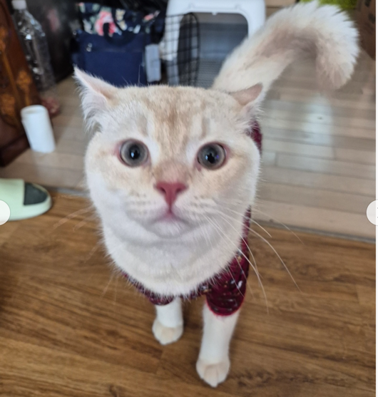

# **IoT Service**

- IoT Service는 Spring Boot와 Spring Cloud 기반으로, 다양한 IoT 센서 데이터를 수집·저장·실시간 처리하고, Redis, WebSocket, Feign 등 최신 기술을 활용해 API 통합 및 실시간 서비스를 제공합니다.

---

## **소개**

- IoT Service는 다양한 IoT 센서(온도, 습도, CO2 등)에서 수집된 데이터를 효율적으로 관리하고, 실시간으로 처리·분석·알림을 제공하는 백엔드 서비스입니다.

- 센서 데이터는 REST API, Redis Pub/Sub, WebSocket 등 다양한 방식으로 수집·전달되며, 룰 엔진과 연동해 자동화된 환경 제어 및 알림이 가능합니다.

---

## **주요 기능**

- IoT 센서 등록/관리/상태 모니터링
- 센서-사용자 매핑 및 권한 관리
- 실시간 센서 데이터 수집 (REST, WebSocket, Redis Pub/Sub)
- 룰 평가 결과 저장 및 제공
- API 및 WebSocket을 통한 데이터 송수신
- Spring Cloud 기반 외부 서비스 연동(Feign)
- API 인증/인가 및 사용자 정보 ThreadLocal 관리

---

## **아키텍처**

- 센서 데이터는 REST API, WebSocket, Redis Pub/Sub 등 다양한 경로로 수집
- 서비스 내부에서 도메인, DTO, Repository, Service, Controller로 계층 분리
- 실시간 데이터는 Redis Pub/Sub, WebSocket으로 처리
- Spring Cloud/Feign으로 외부 서비스 통합

---

---
## **기술 스택**

-------
## 기여자
|  |  |
|--------------------------------------------------------------------------------------------|------------------------------------------------------------------------------------------|
| [강승우의 GitHub](https://github.com/oculusK)                                                  | [박형호의 GitHub](https://github.com/phh624)                                                |
